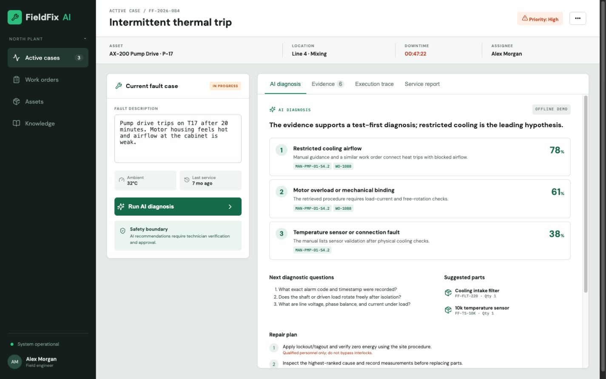

# FieldFix AI

FieldFix AI is a portfolio-grade industrial maintenance diagnosis workspace. A technician describes a fault; the system retrieves synthetic manuals and prior work orders, ranks up to three grounded root causes, asks the next diagnostic questions, suggests conditional spares, proposes a safety-first repair plan, and generates an approved service report.



It is designed to remain fully demonstrable without an API key. No Coresystems trademarks, source code, or customer data are used.

 

## Run from zero

### Docker (recommended)

```bash
cp .env.example .env
docker compose up --build
```

Open <http://localhost:5173>. The deterministic fallback activates automatically when `OPENAI_API_KEY` is empty.

### Local development

Requires Python 3.12+ and Node 20+.

```bash
python -m venv .venv
source .venv/bin/activate
pip install -r backend/requirements.txt
(cd backend && uvicorn app.main:app --reload)
```

In a second terminal:

```bash
cd frontend
npm install
npm run dev
```

Optional live model mode:

```bash
export OPENAI_API_KEY='your-key'
export OPENAI_MODEL='gpt-4o-mini'
```

Keys are read only from environment variables; `.env` is ignored.
Cost telemetry uses the configurable per-million-token rates in `.env.example`; update them when changing models or pricing.

## What the demo proves

- Three ranked root-cause hypotheses with bounded confidence
- Verifiable manual/work-order citations from the retrieved set
- Next diagnostic questions, conditional parts, and sequenced repair steps
- Pydantic-validated model JSON plus a cross-field citation guard
- Explicit abstention when fewer than two relevant records are retrieved
- Human approval before a structured service report is generated
- Visible execution trace, latency, model mode, and estimated model cost
- Idempotent JSON → SQLite ingestion and a replaceable repository boundary

See [the architecture](docs/ARCHITECTURE.md), [the 90-second script](DEMO_SCRIPT.md), and three decisions in [`docs/adr`](docs/adr).

## API

- `GET /api/health` — health and ingestion check
- `POST /api/diagnose` — retrieve, diagnose, validate, and return telemetry
- `POST /api/reports` — require approval and produce the service report
- Interactive documentation: <http://localhost:8000/docs>

## Tests and evaluation

```bash
(cd backend && pytest -q)
(cd frontend && npm run build)
(cd frontend && npx playwright install chromium && npm run test:e2e)
```

The E2E runner selects the project `.venv` directly, so it does not depend on the currently activated Conda environment. You can override it with `FIELDFIX_PYTHON=/path/to/python`.

`evals/cases.json` contains 20 checked retrieval/abstention scenarios. Pytest checks idempotent ingestion, API behavior, evidence-ID integrity, approval enforcement, and all eval cases. Playwright exercises the complete technician workflow. GitHub Actions runs backend, build, and browser tests.

## Safety and limitations

This is a synthetic demonstration, not a certified maintenance system. Confidence in fallback mode is heuristic, parts are conditional, and a qualified technician must verify measurements, lockout/tagout, manufacturer instructions, and site procedures. The UI exposes limitations rather than converting weak retrieval into a confident answer. The trace records workflow events, not hidden chain-of-thought.

## AI-assisted development workflow

AI accelerated scaffolding, UX copy, test generation, and review, but the engineering process constrains its output:

1. Human-authored contracts define required fields, evidence boundaries, approval, and abstention behavior.
2. Model output is parsed into strict Pydantic types; cross-field validation rejects fabricated citation IDs.
3. The model sees only retrieved synthetic evidence and receives an explicit no-invention instruction.
4. Deterministic tests cover security-relevant invariants, 20 eval cases cover retrieval and abstention, and E2E covers the user journey.
5. Developers review diffs, run CI, inspect changed schemas and prompts, and manually spot-check citations before merging. Generated code receives no special trust.

For production, add authenticated users, asset-scoped authorization, audit persistence, calibrated evals with domain experts, real search infrastructure, prompt/version tracking, observability, and a formal safety case.

## License

Copyright © 2026 Ruidong Yang.

This project is licensed under the MIT License. See `LICENSE` for details.

## Repository map

```text
backend/app/       API, contracts, repository, diagnosis orchestration
backend/tests/     API, invariant, ingestion, and eval tests
frontend/src/      React industrial case workspace
data/sources/      Synthetic manuals and work orders
evals/             20 regression cases
docs/adr/          Architecture decisions
```
