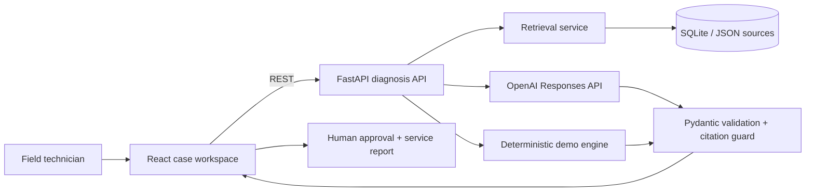

# Architecture

## Boundaries

- `backend/app/repository.py`: persistence and lexical retrieval. The service only depends on its interface.
- `backend/app/diagnosis.py`: orchestration, model adapter, fallback, citation guard, and telemetry.
- `backend/app/models.py`: API and model-output contracts.
- `backend/app/main.py`: HTTP boundary and lifecycle only.
- `frontend/src`: case-oriented UI and API adapter.

The workflow is deliberately a single agent pipeline: retrieve, reason, validate, approve, report.

